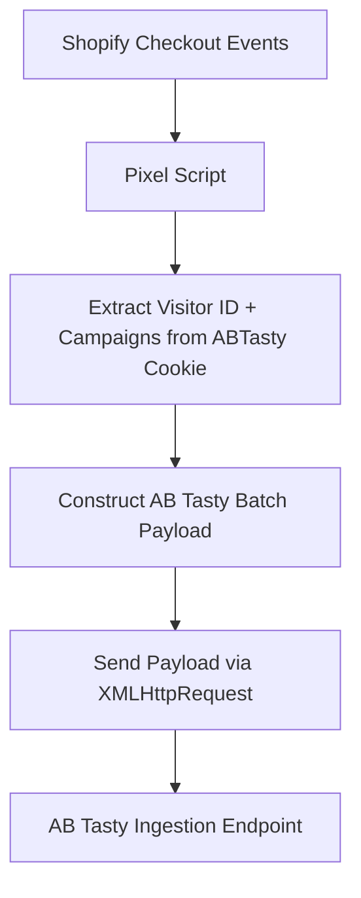

# Shopify Checkout Events Pixel

## Overview
This repository showcases a custom pixel script for Shopify’s extensibility checkout, seamlessly integrated on top of the native [AB Tasty Shopify app](https://apps.shopify.com/ab-tasty-1) to capture and forward key checkout events.  

By leveraging the AB Tasty cookie, the script ensures all payloads are tied to a **unique visitor ID (vid)** and their **active campaigns/variations**, enabling attribution of transactions back to experiments.

When the **"Handle Checkout on Subdomain"** option is enabled, AB Tasty cookies will persist throughout the checkout process. This ensures that data can be effectively tracked and targeted using the Shopify custom pixel.


---

## Why This Pixel Matters

- Shopify’s checkout extensibility was introduced to enhance security, preventing third-party scripts from executing. However, third-party data can still be captured in headless environments. Using a custom pixel allows you to natively track **customer journey milestones**.  
- AB Tasty requires events to be sent in **batch ingestion format** to correctly attribute experiments.  
- This pixel **bridges the gap** by listening to checkout events, enriching them with AB Tasty visitor and campaign context, and forwarding the data to the AB Tasty ingestion API.

---

## How It Works
1. **Initialization**  
   - Script wrapped in an IIFE to avoid polluting the global scope.  
   - Console logging is added for observability in test and QA environments.  

2. **Cookie Extraction**  
   - Reads the `ABTasty` cookie.  
   - Extracts:
     - **Visitor ID (`vid`)** → AB Tasty unique visitor identifier.  
     - **Campaigns (`c`)** → Map of campaign IDs and variation IDs.
    
   Example:
   ```json
   {
     "vid": "visitor123",
     "campaigns": { "1501519": "1870324", "1508732": "1879639" }
   }

3. **Payload Construction**  
   - Builds a JSON payload conforming to AB Tasty’s **batch ingestion format**.  
   - Appends `EVENT` or `TRANSACTION` objects depending on the checkout event type.  

4. **Payload Dispatch**  
   - Sends payloads to **`https://ariane.abtasty.com/`** using `XMLHttpRequest`.  
   - Logs success/error status to the console.  

5. **Shopify Checkout Integration**  
   - Uses `analytics.subscribe` from Shopify Checkout Extensibility:  
     - `checkout_started` → sends **EVENT payload**.  
     - `checkout_completed` → sends **TRANSACTION payload** with order details.  
     
---
     
## Code Flow



### Checkout Started Event Payload (`EVENT`)

```json
{
  "cid": "647122547a691c3986656385348xxxxx",
  "vid": "visitor123",
  "c": { "1501519": "1870324", "1508732": "1879639" },
  "dl": "https://shop.com/checkout",
  "dr": "https://shop.com/cart",
  "pt": "Checkout",
  "cst": 1738210000000,
  "t": "BATCH",
  "h": [
    {
      "t": "EVENT",
      "ec": "Action Tracking",
      "ea": "checkout_started",
      "qt": 502
    }
  ]
}
```

### Checkout Completed Transaction Payload (`TRANSACTION`)

```json
{
  "cid": "647122547a691c3986656385348xxxxx",
  "vid": "visitor123",
  "c": { "1501519": "1870324", "1508732": "1879639" },
  "dl": "https://shop.com/checkout/thank_you",
  "dr": "https://shop.com/checkout",
  "pt": "Order Confirmation",
  "cst": 1738210050000,
  "t": "BATCH",
  "h": [
    {
      "t": "TRANSACTION",
      "tid": "order123",
      "ta": "Purchase",
      "tr": "99.99",
      "tc": "GBP",
      "ts": "4.99",
      "icn": 3,
      "qt": 503
    }
  ]
}
```

---

## Further Documentation

- [Shopify Web Pixels API – Checkout Started](https://shopify.dev/docs/api/web-pixels-api/standard-events/checkout_started)  
- [Shopify Web Pixels API – Checkout Completed](https://shopify.dev/docs/api/web-pixels-api/standard-events/checkout_completed)  
- [AB Tasty Transaction Tracking – Getting Started](https://docs.abtasty.com/client-side/transaction-tag-implementation/transaction-tracking-getting-started)

---

## Full Working Snippet

```javascript
(function() {
  const ABTASTY_CID = "647122547a691c3986656385348xxxxx";

  function safeGetCookie(name) {
    try {
      const match = document.cookie.match(new RegExp(name + "=([^;]+)"));
      return match ? decodeURIComponent(match[1]) : null;
    } catch (e) { return null; }
  }

  function extractUidAndCampaignsFromCookie() {
    const abCookie = safeGetCookie("ABTasty");
    if (!abCookie) return { uid: null, campaigns: {} };

    const params = new URLSearchParams(abCookie);
    const uid = params.get("uid");
    const th = params.get("th");
    let campaigns = {};

    if (th) {
      th.split("_").forEach(token => {
        const match = token.match(/^(\d+)\.(\d+)/);
        if (match) campaigns[match[1]] = match[2];
      });
    }

    return { uid, campaigns };
  }

  function fetchABTastyData() {
    const { uid, campaigns } = extractUidAndCampaignsFromCookie();
    return uid ? { vid: uid, campaigns } : { vid: null, campaigns: {} };
  }

  function constructPayload(vid, campaigns, eventType, eventDetails = {}) {
    if (!vid) return null;
    const basePayload = { cid: ABTASTY_CID, vid, c: campaigns || {}, dl: window.location.href, dr: document.referrer || window.location.href, pt: document.title || "", cst: Date.now(), t: "BATCH", h: [] };

    if (eventType === "EVENT") {
      basePayload.h.push({ t: "EVENT", ec: eventDetails.ec || "Action Tracking", ea: eventDetails.ea || "checkout_started", qt: eventDetails.qt || 502 });
    } else if (eventType === "TRANSACTION") {
      basePayload.h.push({ t: "TRANSACTION", tid: eventDetails.tid, ta: eventDetails.ta || "Purchase", tr: eventDetails.tr, tc: eventDetails.tc, ts: eventDetails.ts, icn: eventDetails.icn, qt: eventDetails.qt || 503 });
    }

    return basePayload;
  }

  function sendBatch(payload) {
    if (!payload) return;
    var xhr = new XMLHttpRequest();
    xhr.open("POST", "https://ariane.abtasty.com/", true);
    xhr.setRequestHeader("Content-Type", "text/plain");
    xhr.send(JSON.stringify(payload));
  }

  function getTransactionId(checkout) { return checkout.order?.id || checkout.id; }
  function getTotalRevenue(checkout) { return checkout.totalPrice?.amount || 0; }
  function getCurrency(checkout) { return checkout.totalPrice?.currencyCode || "GBP"; }
  function getItemCount(checkout) { return checkout.lineItems.reduce((sum, item) => sum + item.quantity, 0); }
  function getTransactionShipping(checkout) { return checkout.totalShippingPrice?.amount || 0; }

  (function init() {
    analytics.subscribe("checkout_started", (event) => {
      const { vid, campaigns } = fetchABTastyData();
      if (!vid) return;
      sendBatch(constructPayload(vid, campaigns, "EVENT", { ea: "checkout_started" }));
    });

    analytics.subscribe("checkout_completed", (event) => {
      const checkout = event.data.checkout;
      const { vid, campaigns } = fetchABTastyData();
      if (!vid) return;
      sendBatch(constructPayload(vid, campaigns, "TRANSACTION", { tid: getTransactionId(checkout), tr: getTotalRevenue(checkout), tc: getCurrency(checkout), icn: getItemCount(checkout), ts: getTransactionShipping(checkout) }));
    });
  })();
})();
```
