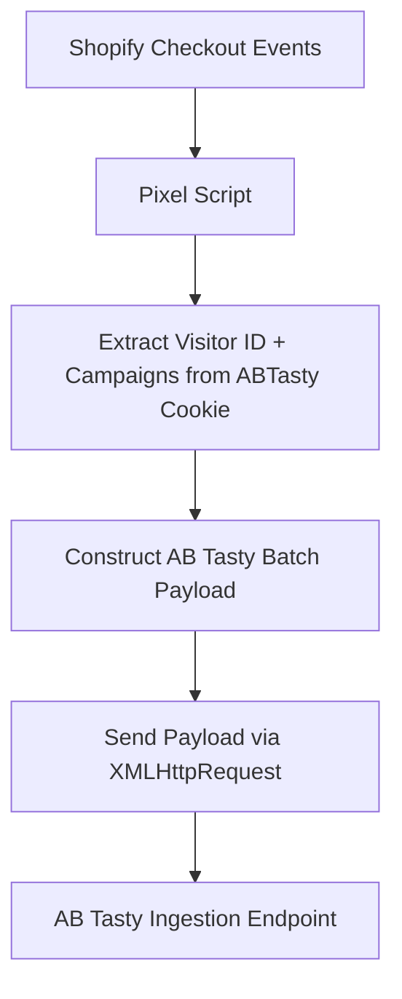

# Shopify Checkout Events Pixel

## Overview
This repository provides a **custom pixel script** designed for **Shopify’s extensibility checkout**.  
The pixel listens to key lifecycle events — `checkout_started` and `checkout_completed` — and pushes them into **AB Tasty** for experimentation, personalization, attribution, and analytics workflows.  

By leveraging the AB Tasty cookie, the script ensures all payloads are tied to a **unique visitor ID (vid)** and their **active campaigns/variations**, enabling attribution of transactions back to experiments.

---

## Why This Pixel Matters
- Shopify’s checkout extensibility allows developers to capture **customer journey milestones** natively.  
- AB Tasty requires events to be passed in **batch ingestion format** to properly attribute experiments.  
- This pixel **bridges the gap**: listening to checkout events, enriching them with AB Tasty visitor/campaign context, and forwarding to the AB Tasty ingestion API.  

---

## How It Works
1. **Initialization**  
   - Script wrapped in an IIFE to avoid polluting the global scope.  
   - Console logging is added for observability in test and QA environments.  

2. **Cookie Extraction**  
   - Reads the `ABTasty` cookie.  
   - Extracts:
     - **Visitor ID (`vid`)** → AB Tasty unique visitor identifier.  
     - **Campaigns (`c`)** → Map of campaign IDs and variation IDs.  

   Example:
   ```json
   {
     "vid": "visitor123",
     "campaigns": { "1001": "2001", "1002": "2002" }
   }
   ```

3. **Payload Construction**  
   - Builds a JSON payload conforming to AB Tasty’s **batch ingestion format**.  
   - Fields include:
     - `cid` → AB Tasty client/site ID  
     - `vid` → visitor ID  
     - `c` → campaigns map  
     - `dl` → current page URL  
     - `dr` → referrer URL  
     - `pt` → page title  
     - `cst` → timestamp  

4. **Payload Dispatch**  
   - Sends payloads to **`https://ariane.abtasty.com/`** using `XMLHttpRequest`.  
   - Includes success/error console logs.  

5. **Shopify Checkout Integration**  
   - Uses `analytics.subscribe` from Shopify Checkout Extensibility:  
     - `checkout_started` → sends **EVENT payload**.  
     - `checkout_completed` → sends **TRANSACTION payload** with order details.  

---

## Code Flow



---

## Payload Examples

### `checkout_started` → EVENT

```json
{
  "cid": "647122547a691c3986656385348f326a",
  "vid": "visitor123",
  "c": { "1001": "2001" },
  "dl": "https://shop.com/checkout",
  "dr": "https://shop.com/cart",
  "pt": "Checkout",
  "cst": 1738210000000,
  "t": "BATCH",
  "h": [
    {
      "t": "EVENT",
      "ec": "Action Tracking",
      "ea": "checkout_started",
      "qt": 502
    }
  ]
}
```

### `checkout_completed` → TRANSACTION

```json
{
  "cid": "647122547a691c3986656385348f326a",
  "vid": "visitor123",
  "c": { "1001": "2001" },
  "dl": "https://shop.com/checkout/thank_you",
  "dr": "https://shop.com/checkout",
  "pt": "Order Confirmation",
  "cst": 1738210050000,
  "t": "BATCH",
  "h": [
    {
      "t": "TRANSACTION",
      "tid": "order123",
      "ta": "Purchase",
      "tr": "99.99",
      "tc": "GBP",
      "ts": "4.99",
      "icn": 3,
      "qt": 503
    }
  ]
}
```

---

## Key Functions Explained

### Cookie Handling
- `safeGetCookie(name)` → safely retrieves cookies.  
- `extractUidAndCampaignsFromCookie()` → parses AB Tasty cookie for `vid` and campaigns.  

### AB Tasty Data Fetcher
- `fetchABTastyData()` → wrapper returning `{ vid, campaigns }`.  

### Payload Builder
- `constructPayload(vid, campaigns, eventType, eventDetails)` → creates structured batch payload.  

### Shopify Checkout Helpers
- `getTransactionId(checkout)` → order ID  
- `getTotalRevenue(checkout)` → total revenue  
- `getCurrency(checkout)` → currency code  
- `getItemCount(checkout)` → item count  
- `getTransactionShipping(checkout)` → shipping amount  

### Event Subscriptions
- `checkout_started` → triggers **EVENT payload**  
- `checkout_completed` → triggers **TRANSACTION payload**  

---

## Installation

```bash
git clone https://github.com/<your-org>/shopify-checkout-events-pixel.git
cd shopify-checkout-events-pixel
```

1. Copy `pixel.js` into your Shopify app extension.  
2. In **Shopify Admin → Customer Events**, register the pixel.  
3. Deploy and validate using console logs and AB Tasty reporting.  

---

## Integration Notes
- Requires the `ABTasty` cookie to be present.  
- Payloads sent to **https://ariane.abtasty.com/** in batch format.  
- Designed for **Shopify Checkout Extensibility**.  
- Extensible to capture more events (e.g., cart updates, payment step).  

---

## Contributing
- Open an issue for feature requests or bug reports.  
- Submit PRs with clear commit messages and test steps.  

---

## License
MIT License
